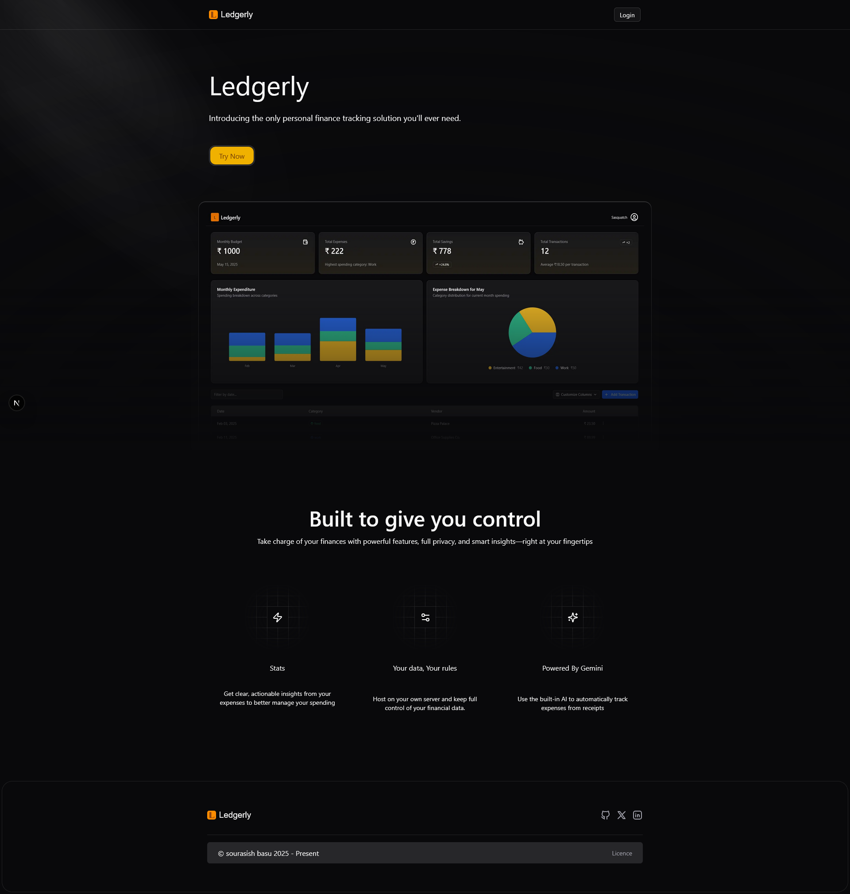
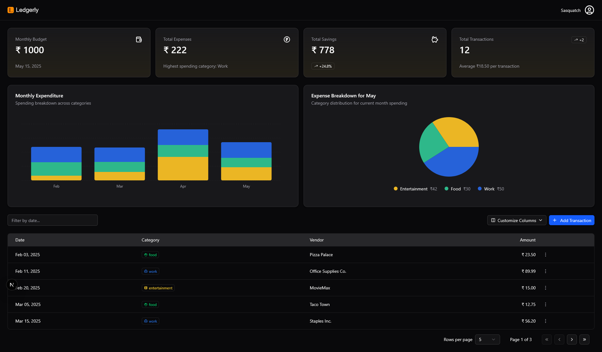

<h1 align="center">Ledgerly</h1>

<p align="center">
  An open source, self hostable expense tracking platform built with NextJS, Python<br>
  and AWS for the Lambda functions and S3 object storage.<br>Manage and gain insights from your expenses.
</p>

<p align="center">
  <a href="#features"><strong>Features</strong></a> ·
  <a href="#overview"><strong>Overview</strong></a> ·
  <a href="#aws-setup"><strong>AWS Setup</strong></a> ·
  <a href="#remote-backend-setup"><strong>Backend Setup</strong></a> ·
  <a href="#usage"><strong>Usage</strong></a> ·
  <a href="#monitoring"><strong>Monitoring</strong></a> ·
  <a href="#authors"><strong>Authors</strong></a>
</p>

## Features

- **Website**
  - [NextJS](https://nextjs.org) App Router
  - [Amazon Web Services](https://docs.aws.amazon.com/) for backend functionality with `EC2`
  - Support for `S3` File Storage, and `Lambda` Container image based Functions
  - Edge runtime-ready
  
- **AWS Infrastructure**
  - [Amazon S3/Minio](https://aws.amazon.com/s3) Utilized for image storage.
  - [AWS Lambda](https://aws.amazon.com/lambda) for processing JSON and filtering required data
  - [Amazon EC2](https://aws.amazon.com/sns) for provisioning VM instances 
  - [Amazon ECR](https://aws.amazon.com/ecr) for privately hosting container images 

- **External**
  - [Prometheus](https://prometheus.io/docs/introduction/overview/), [Grafana](https://grafana.com/docs/grafana/latest/) and [GoAccess](https://goaccess.io/) for extensive observability and monitoring of resources. 
  - [Gemini API](https://ai.google.dev/gemini-api/docs) for image to text extraction using Vision Model within free tier limits.
  - [Github Actions](https://github.com/features/actions) CI pipelines to build, test and push application images from Github to various registries.
  - [Traefik](https://doc.traefik.io/) acts as a dynamic reverse proxy and automatically manages SSL/TLS certificates

### Tech Stack


## Overview


- The **backend** consists of 3 main services being the **Python based REST API** developed using **FastAPI** for serving requests, performing CRUD operations, a **RDS Postgres** database for data storage and retrieval and a **S3 Bucket** for image storage and hosting.
- The other 5 services consist of **Traefik** as reverse proxy, utilized for automatic SSL provision, log creation and **Prometheus**, **Grafana** for resource usage collection and visualization using custom **log exporters**.
- All of these services are run using **Docker** containers to ensure availability and performance.

## Project Structure

```
.
├── AWS-setup.md
├── README.md
├── assets
├── deployment
│   ├── ansible
│   │   ├── inventory
│   │   ├── playbook.yml
│   │   └── roles
│   │       ├── common
│   │       │   └── tasks
│   │       │       └── main.yml
│   │       ├── docker
│   │       │   └── tasks
│   │       │       └── main.yml
│   │       ├── files
│   │       │   └── tasks
│   │       │       └── main.yml
│   │       └── tools
│   │           └── tasks
│   │               └── main.yml
│   ├── docker-compose.cloud.yml
│   ├── docker-compose.local.yml
│   ├── grafana
│   │   └── datasources.yml
│   ├── ledgerly.sql
│   └── prometheus
│       └── prometheus.yml
├───frontend
│   └─── ledgerly
│        ├─── app
│        │    └─── dashboard
│        ├─── bun.lock 
│        ├─── components
│        │    └─── ui
│        ├─── components.json
│        ├─── eslint.config.mjs
│        ├─── hooks
│        ├─── next.env.d.ts
│        ├─── next.config.ts
│        ├─── package.json
│        ├─── postcss.config.mjs
│        └─── tsconfig.json
└── services
    ├── backend
    │   ├── Dockerfile
    │   ├── app
    │   │   ├── __init__.py
    │   │   ├── app.py
    │   │   ├── core
    │   │   │   ├── __init__.py
    │   │   │   ├── config.py
    │   │   │   ├── db.py
    │   │   │   └── utils.py
    │   │   ├── db
    │   │   │   ├── __init__.py
    │   │   │   └── models.py
    │   │   ├── main.py
    │   │   └── routers
    │   │       ├── __init__.py
    │   │       ├── auth.py
    │   │       ├── deps.py
    │   │       └── receipts.py
    │   ├── pyproject.toml
    │   └── uv.lock
    └── receipt-ocr
        ├── Dockerfile
        └── app.py
```

Primary Services:
- `frontend/ledgerly:` This subdirectory contains the frontend for the Ledgerly application dashboard.
- `services/backend:` This subdirectory consists of the primary backend API for the entire application facilitating user registration, login, image upload and CRUD operations with the database.
- `services/receipt-ocr:` This subdirectory consists of the helper application which extracts relevant data using an LLM from user submitted receipt images and adds these records into the database.
- `deployment/:` This folder consists of all configurations required for the deploying the services and monitoring systems.

# AWS Setup

> [!NOTE]  
> The default architecture is based on AWS services, however all of the services and tooling can be setup within any other cloud platform of choice or self hosted locally as well if required. Please refer to [AWS Setup](./AWS-setup.md) for setup instructions in the AWS cloud.

# Local Setup

1. Clone the repository locally. Add the environment variables as per the `.env.example` into the `.env` file within the `deployment` directory.

    ```bash
    git clone https://github.com/sourasishbasu/ledgerly.git
    cd ledgerly/deployment
    touch .env
    ```

2. Install [Docker](https://docs.docker.com/desktop/). Run the containers with `Docker Compose`.

    ```
    docker compose up -f docker-compose.local.yml --build --pull missing -d
    ```
3. Install the [Minio Client](https://min.io/docs/minio/linux/reference/minio-mc.html) and add it to PATH. 

    - Run the following commands to setup a local S3 compatible object storage bucket named `images`.
      ```bash
      mc alias set local http://localhost:9000 minio minio123
      mc mb local/images
      ```

    - Configure a Webhook to listen for `s3:ObjectCreated:PUT` events in the bucket and automatically send event notifications to OCR service worker.
      ```bash
      mc admin config set local notify_webhook:trigger endpoint="http://worker:8000/event" && mc admin config set local notify_webhook:trigger format=json
      mc admin service restart local
      mc event add local/images arn:minio:sqs::trigger:webhook --event put --suffix .jpg
      mc event add local/images arn:minio:sqs::trigger:webhook --event put --suffix .jpeg
      mc event add local/images arn:minio:sqs::trigger:webhook --event put --suffix .png
      ```

    - To list images in Minio, run the following command.
      ```bash
      mc ls local/images
      ```

4. Copy the contents of `deployment/ledgerly.sql` into the SQL Query Editor within any database tool after connecting to the postgres database container.

5. Install Node v22 and [Bun](https://bun.sh/docs/installation). Run the development server for the frontend.
    ```
    cd ../frontend/ledgerly/frontend
    bun dev
    ```

## Expected Result

```bash
$ docker compose ps
NAME       IMAGE                        COMMAND                  SERVICE    CREATED          STATUS                    PORTS
api        ghcr.io/sourasishbasu/expense-tracker-api:latest   "fastapi run app/mai…"   api        48 minutes ago   Up 48 minutes (healthy)   0.0.0.0:5000->5000/tcp
minio      minio/minio                  "/usr/bin/docker-ent…"   minio      2 hours ago      Up 2 hours                0.0.0.0:9000-9001->9000-9001/tcp
postgres   postgres:latest              "docker-entrypoint.s…"   postgres   2 hours ago      Up 2 hours (healthy)      0.0.0.0:5432->5432/tcp
worker     ghcr.io/sourasishbasu/receipt-ocr:latest           "fastapi run app.py"     worker     48 minutes ago   Up 48 minutes (healthy)   0.0.0.0:8000->8000/tcp

```

# Usage

> [!NOTE]
> Detailed API docs along with examples and template data can be found at [Scalar Docs](https://expense-tracker.apidocumentation.com/).

### Routes

Backend API: `http://localhost:5000`

Web Dashboard: `http://localhost:3000`

Minio Dashboard: `http://localhost:9001`

## Demo
https://github.com/user-attachments/assets/9e9d73c8-0b6d-4dd6-baee-66e1c0fc3c48
<p align="center"><b>Ledgerly Demo</b></p>

### Screenshots

<p align="middle"><strong>Landing Page</strong></p>
<br>

<p align="middle"><strong>Dashboard</strong></p>


## Authors

This project was made for Project Wing 2025 by [MLSAKIIT](https://mlsakiit.com/).

- Sourasish Basu ([@SourasishBasu](https://github.com/SourasishBasu)) - [MLSA KIIT](https://mlsakiit.com)

## Version
| Version | Date          		| Comments        |
| ------- | ----------------- | --------------- |
| 1.0     | May 21st, 2025    | Revised release |
